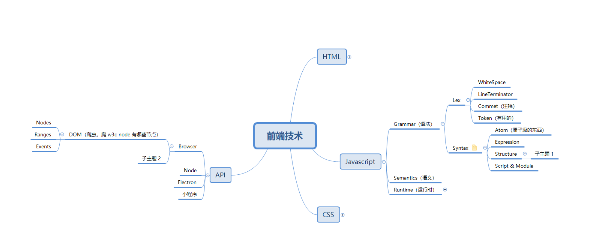
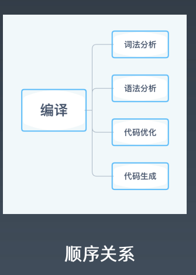
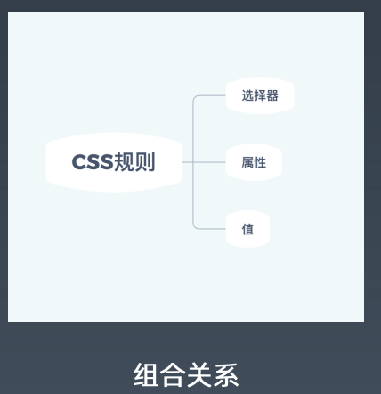
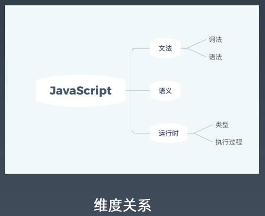
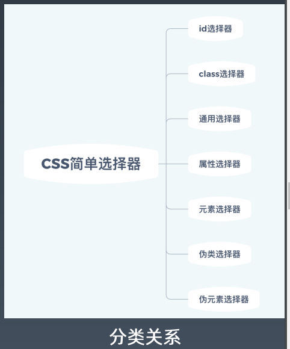
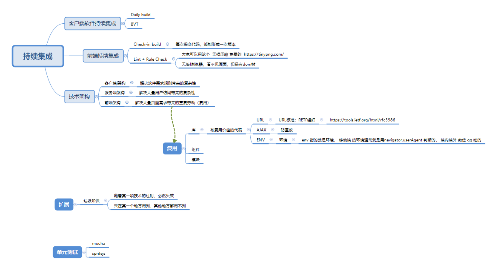

# 第一周学习总结

## 作业

### 前端知识整理

[文件链接](./前端技术.xmind)

## day1

### 前端技能模型

分为 5 大块

- 领域知识
- 前端知识
- 编程能力
- 架构能力--解决规模大的问题
- 工程能力--解决团队协作的问题

### 学习方法

#### 整理法

首先，对知识的整理要有一定的完备性，对于不同的知识，可以从不同的角度去整理，包括：

- 顺序关系
- 组合关系
- 纬度关系
- 分类关系

课上的例子：

### 追溯法

表面意思，追本溯源。在知识纷杂的环境下，有利于更加接近某项知识、某个概念的含义，希望解决什么样的问题，在什么情况下使用等等。

## day2

### 前端技术整理

作业中的脑图概括的比较详细了，就不再赘述。

## day3

### winter眼中的优秀工程师

#### 领域知识

#### 能力

(编程能力-解决问题能力，架构能力-解决大规模的问题，工程能力-多少人一起做的能力)

#### 潜力

职业规划(执行力，毅力)

>  **who are the owner of your career**

##### 职业发展：成长-->成就-->晋升-->成长

1. 业务型成就

   - 业务目标：理解公司的核心目标；目标转化为指标
   - 技术方案：业务指标到技术指标的转换；形成纸面方案，完成小规模试验实施方案：确定实施目标，参与人；管理实施进度
     - 结果评估：数据采集、数据报表；向上级汇报
       -例子--导购应用手势
       技术方案：给tab组件增加手势操作
       实施：在业务中加入对应能力，并上线
       结果：点击率提升3倍
     - 实施2：编写通用tab组件， 向所有导购业务推广， 形成制度
       结果+：推广到所有导购业务，符合预期
2. 技术难题型成就
  - 目标：公认的技术难点
    实施与方案：依靠扎实的标称能力、架构能力形成解决方案
    结果：问题解决

  - 例子--爬取商城价格
将模式识别应用到js，通过前端识别图片中价格

3. 工程型成就

   - 目标：质量、效率

     实施和方案：规章制度；库；工具；系统；

     结果：线上监控

	- 案例--XSS攻击的预防

     目标&指标：XSS攻击白帽子反馈漏铜
   
      技术方案：整理安全手册， review历史代码， 代码扫描工具
   
      实施：对全体前端宣讲， 整体review代码， 更改代码发布流程
   
      结果：XSS漏洞大幅减少

##### 持续集成

[脑图下载](./持续集成.xmind)

#### 简历

- 尽量用量化的东西，严格标准，来应征自己能力

- 一些努力，通过某种成就来完成。成就就是客观存在，实际的