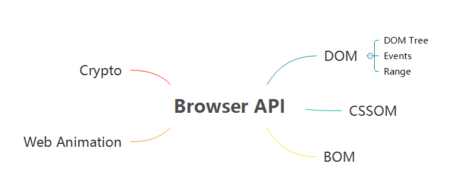
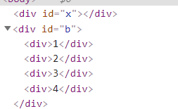
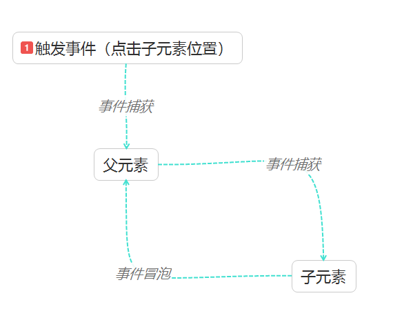
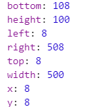

# 浏览器API


## DOM

> 参考链接：
>
> https://www.w3.org/TR 

浏览器api 主要分为以下几块内容，这篇文章只会摘取每一块的部分内容详细讲一讲，let's go。

 

### DOM Tree

#### 1. appendChild

​	appendChild 的作用是追加一个元素，如果这个元素在页面中存在，执行后就移除原来的元素。

- 移动子节点的位置

    在下面这个示例中，就会把 “x” 元素中的子节点移动到 "b" 节点中：
    
    ```html
    <div id="x">
        <div>1</div>
        <div>2</div>
        <div>3</div>
    <div>4</div>
    </div>
    
    ```
<div id="b">
    </div>

    <script>
    var x = document.getElementById("x");
        var b = document.getElementById("b");
    
        while(x.children.length) {
            b.appendChild(x.children[0]);
        }
    </script>
    ```
    
    执行后的效果如下，x 元素的子节点被全部挪到了 b 元素中：



- 逆序

  将 x 中的子节点逆序

  ```
  <div id="x">
      <div>1</div>
      <div>2</div>
      <div>3</div>
      <div>4</div>
  </div>
  
  <script>
      var x = document.getElementById("x");
  
       // 逆序
       for(var i = x.children.length - 1;i >= 0 ; i--) {
           x.appendChild(x.children[i])
       }
  </script>
  
  ```

  

### DOM Event

#### 1. addEventListener

> https://developer.mozilla.org/en-Us/docs/Web/API/EventTarget/addEventListener

纳入标准的event有两种语法形式：

```javascript
target.addEventListener(type, listener [, options]);
target.addEventListener(type, listener [, useCapture]);
```

- type

  第一个参数就是事件的类型

- listener

  第二个参数可以是一个实现了 `Event` 接口的对象，也可以是一个函数

- options  (可选)

  有关 `listener` 属性的设置。

  - capture

    表示是否在捕获阶段触发

  - once

    触发一次后自动移除

  - passive

    true: 表示 `listener` 永远不会调用 `preventDefault()` ，如果调用了就会忽略，并抛出警告

- useCapture  (可选)

  true: 捕获阶段触发事件

  false: 冒泡阶段触发事件

##### 捕获与冒泡的顺序

​	上面的事件监听提到了捕获阶段和冒泡阶段，我们知道，捕获阶段是从**外层向内层传递**，冒泡阶段是从**内层向外层传递**。所以，当触发了同一种类型的事件，一定是**先从最外层捕获，再从最内层冒泡**。



​	我们就以下面这一段 html 为例，做一个小实验：

```html
<div id="a" style="width: 500px; height: 300px; background-color: lightgreen;">
    <div id="c" style="width: 300px; height: 100px; background-color: pink;"></div>
</div>
```

- 冒泡	

  如果我们不设置 useCapture，那么就是事件冒泡，代码如下

  ```javascript
      document.getElementById("a").addEventListener("click", { handleEvent: function() {
          console.log("a");
       }});
  
       document.getElementById("c").addEventListener("click", { handleEvent: function() {
          console.log("c");
       }});
  ```

  ​	点击 c 元素所在区域， 结果是：

  ```
  c
  a
  ```

  ​	先触发内层元素事件，再触发外层。

- 捕获

  其他的代码都一样，我们把 useCapture 设为 `true` :

  ```javascript
      document.getElementById("a").addEventListener("click", { handleEvent: function() {
          console.log("a");
       }}, true);
  
       document.getElementById("c").addEventListener("click", { handleEvent: function() {
          console.log("c");
       }}, true);
  ```

  结果变成了：

  ```
  a
  c
  ```

  现在是先触发外层，再触发内层。

### DOM Range

> https://developer.mozilla.org/en-US/docs/Web/API/Range

Range 中最常用的方法有如下几个，其他的方法可以去上面的链接查找：

- setStart (startNode, startOffset)

  设置起点

- setEnd (endNode, endOffset)

  设置终点

- extractContents

  把dom树中的内容剪切到 DocumentFragment(文档片段)中

PS: 小知识点 -  文本中一个字符就算一个 ChildNode

#### Range的使用

下面再用两个例子演示一下Range如何使用。

- 逆序（减少重排）

  第一个例子，我们把文章开头的逆序，用Range再实现一次。

  ```html
  <div id="x">
      <div>1</div>
      <div>2</div>
      <div>3</div>
      <div>4</div>
  </div>
  
  <script>
      var x = document.getElementById("x");
      reverseChildren();
  
      function reverseChildren() {
          let range = new Range();
          range.selectNodeContents(x);
  
          let fragment = range.extractContents();  // 放到文档片段中
          let len = fragment.childNodes.length;
  
          while(len--) {
              fragment.appendChild(fragment.childNodes[len]);
          }
          x.appendChild(fragment);
  
      }
  </script>
  ```

  相比较文章开头的方法，用 **Range 大大减少了重排**（一开始的方法每一次循环就重排一次），逆序好之后，一次性放入文档中就搞定了。

- 截取部分片段

  下面代码的作用是截取部分片段，你知道截取的片段是哪一部分吗？

  ```html
  <div id="a">123 <span style="background-color: pink;">fjdleui9ifod</span> 456789</div>
  <script>
      let range = new Range();
      range.setStart(document.getElementById("a").childNodes[0], 2);
      range.setEnd(document.getElementById("a").childNodes[2], 3);
  
      range.extractContents()
  </script>
  ```

  答案：

  截取的部分为：

  ```
  3 <span style="background-color: pink;">fjdleui9ifod</span> 45
  ```

  相信通过这个例子，大家都能了解 `setStart ` 和 `setEnd` 参数的选取范围了。


## CSSOM

> https://developer.mozilla.org/en-US/docs/Web/API/DocumentOrShadowRoot/styleSheets

### 1. styleSheets

每个 styleSheet 都是文档中嵌入的 `style` 或者链接，例如：

```html
<style>
    a {
        color: red;
    }
    a::after{
        content: "world";
        color: royalblue;
    }
</style>
<link rel="stylesheet" href="data:text/css,p%7Bcolor:blue%7D">

<a>Hello</a>
```

要获取 document 中所有的 styleSheet 对象，可以用如下方法：

```
document.styleSheets
```

### 2. CSSStyleSheet

> https://developer.mozilla.org/en-Us/docs/Web/API/CSSStyleSheet

继承自 styleSheet，`document.styleSheets[0]` 就是一个 CSSStyleSheet

- cssRules

  cssRules 是 CSSStyleSheet 中的一个属性，包含了 style中的所有css规则，如下是几个常用的方法。

  - 获取：`document.styleSheets[0].cssRules`

  - 加一个rule：`document.styleSheets[0].insertRule("p{color:pink;}", 0)`

    如果 页面上没有 style 标签，那就没法加规则。如果页面上有一个空的 style 标签，就能加规则了。

  - 移除一条rule：`document.styleSheets[0].removeRule(0)`

### 3. CSSRule

> https://developer.mozilla.org/zh-CN/docs/Web/API/CSSRule

CSSRule 有很多，分别有：

  **CSSStyleRule**
  CSSImportRule
  nsIDOMCSSImportRule
  CSSMediaRule
  CSSFontFaceRule
  CSSPageRule
  CSSKeyframesRule
  CSSKeyframeRule
  CSSNamespaceRule
  CSSCounterStyleRule
  CSSSupportsRule
  CSSDocumentRule
  CSSFontFeatureValuesRule
  CSSViewportRule
  CSSRegionStyleRule

有一个小技巧，可以直接通过 CSSRule 修改 css 属性：

```html
document.styleSheets[0].cssRules[0].style.color = "black"
```

这样可以直接把第一条 cssRule 的 color 改掉。

### 4. getComputedStyle

获取元素计算后的属性值，语法如下：

```
let style = window.getComputedStyle(element, [pseudoElt]);
```

- element

  要获取计算后css属性的元素

- pseudoElt

  指定一个要匹配的伪元素的字符串。必须对普通元素省略（或`null`）

单独使用：

```
getComputedStyle(document.getElementsByTagName("a")[0], null)
```

和伪元素一起使用：

```
getComputedStyle(document.getElementsByTagName("a")[0], "::after")
```

### 5. 视口

> https://developer.mozilla.org/zh-CN/docs/Web/API/Window/open
>
> https://developer.mozilla.org/en-US/docs/Web/API/Element/getBoundingClientRect

- 打开一个新的窗口

  ```
  let childWindow = window.open("about:blank", "_blank", "width=100,height=100,left=100,top=100")
  ```

- 移动位置

  ```
  childWindow.moveBy(-50, -50)
  ```

- 定义大小

  ```
  childWindow.resizeBy(50, 50)
  ```

### 6. 滚动相关api

- 视口滚动区域的大小

  ```
  window.scrollX
  window.scrollY
  ```

- 操纵视口滚动

  ```
  window.scrollBy(0, 100)
  window.scroll(0, 0)
  ```

- 元素滚动区域大小

  ```
  $0.scrollWidth
  $0.scrollHeight
  ```

- 操纵元素滚动

  ```
  $0.scrollBy(300, 300)
  $0.scrollTo(300, 300)
  ```

### 7. 元素的重要信息

- 获取元素（盒）的准确位置

  ```
  $0.getClientRects()[0]
  ```

  **其中的 width 和 height 包含 padding 和 border**

  

  PS: inline 会产生多个盒

- 返回元素的大小，以及相对于视口的位置

  ```
  $0.getBoundingClientRect()
  ```

### 8. 其他

- 视口宽高
- devicePixelRati0:    1px = 几个物理像素

```
window.innerHeight
window.innerWidth
window.devicePixelRatio
```


## 所有API

> https://spec.whatwg.org/