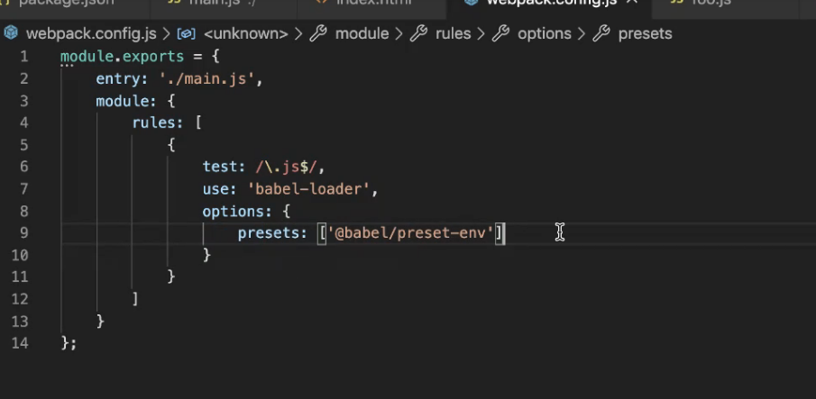
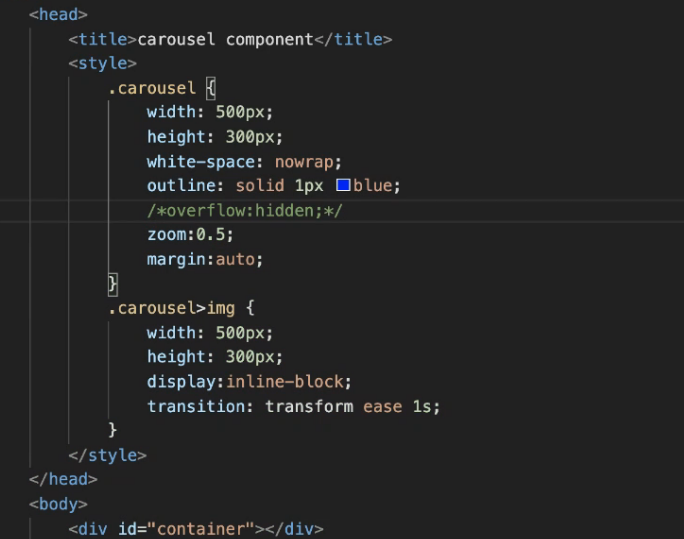
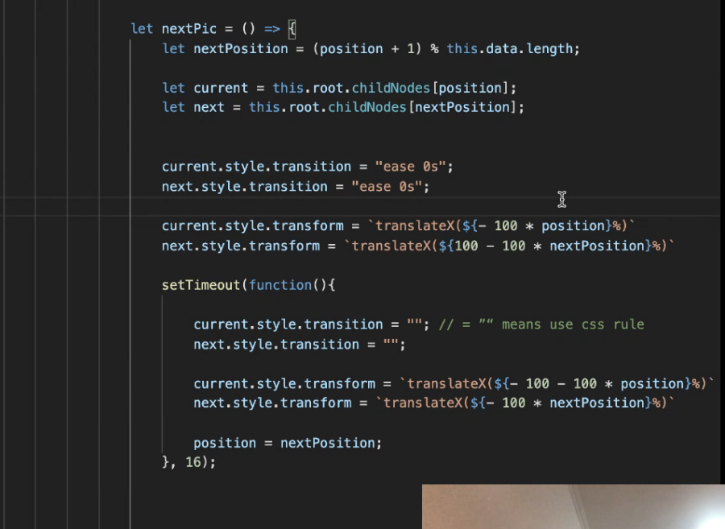

# 每周总结可以写在这里

## JSX

https://reactjs.org/docs/introducing-jsx.html



## babel

https://www.jianshu.com/p/78832d23f176

### babel-loader

原本的作用是把高版本的es语法转成低版本的es语法

### @babel/core

### @babel/preset-env


## 局部安装webpack-cli的调用方法

在 package.json 中如下配置：

```
{
  "scripts": {
    "start": "webpack"
  }
}
```

 

全局没有安装webpack-cli，也可以在package.json里面的script里面直接使用脚本名，不用加上路径。
npm 脚本的原理非常简单。每当执行npm run，就会自动新建一个 Shell，在这个 Shell 里面执行指定的脚本命令。因此，只要是 Shell（一般是 Bash）可以运行的命令，就可以写在 npm 脚本里面。

比较特别的是，npm run新建的这个 Shell，会将当前目录的node_modules/.bin子目录加入PATH变量，执行结束后，再将PATH变量恢复原样。

这意味着，当前目录的node_modules/.bin子目录里面的所有脚本，都可以直接用脚本名调用，而不必加上路径。比如，当前项目的依赖里面有 Mocha，只要直接写mocha test就可以了。



