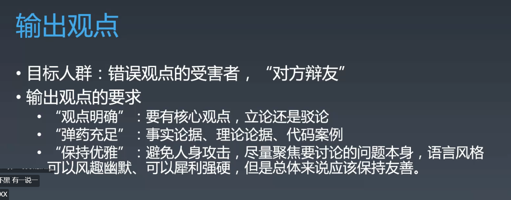

## 说文明的写法

https://www.ruanyifeng.com/blog/2019/09/react-hooks.html

## 议论文的写法

https://zhuanlan.zhihu.com/p/158066098

https://zhuanlan.zhihu.com/p/34777126

顺序关系：

做一件事分成几个步骤

组合关系：

维度关系：

分类关系：

项目上没什么技术难点，但是感觉项目的过程中还是比较困难，怎么办。

可以讲讲工程上有什么难点，工作量大

